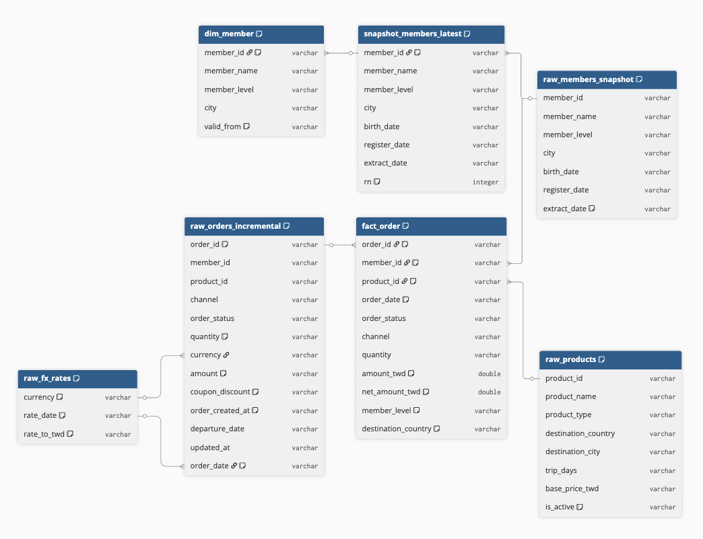

# Part B｜資料表結構總覽（逆向還原 buggy_pipeline.py）

> 受審程式碼：`candidate_package/buggy_pipeline.py`
> 來源資料樣本：`candidate_package/dataset/*.csv`（用於還原欄位 header）
>
> 本節僅依「程式碼實際的讀取與寫入行為」逆向還原資料表與關聯，忠實還原現況；
> 程式碼中的缺漏或反模式如實呈現於 note，不自行補正。詳細的問題影響評估與修正建議見

---

## 0. 整體結論

> 綜合 1 節「真人 Review 建議」與 2 節「AI Review 建議」後的整體結論。

這條管線暴露的不是零星 bug，而是**schema／資料模型設計階段就已經錯誤的一系列基礎缺陷**：
`dim_member` 沒有代理鍵、沒有真正的 SCD2 版本鏈；`fact_order` 沒有代理鍵、混雜了維度屬性、
缺少 `occurred_at`／`ingested_at` 等稽核用時間欄位；`dim_member` 與 `fact_order` 兩個 Delta
寫入之間也沒有交易邊界。這些是 1 節（真人）與 2 節（AI）分別從「資料模型原則」與「程式碼行為」
兩個角度切入，交叉核對後一致指出的結構性問題，而不是各自獨立、互不相關的小毛病。

以下事件也說明了：即使是 AI 自己提出的修正建議，也可能繼承同一套設計盲點——

> **AI 協作事件記錄**
>
> **AI 在哪些地方出錯或不足？如何發現並糾正？**
> AI 在 2.3 節建議直接以 `order_id` 做 `MERGE INTO` 合併鍵來修正 `fact_order` 的冪等性，
> 沒有意識到「`order_id` 是否唯一」正是本管線最大的風險來源之一（2.1 節指出的死碼問題）——
> 用一個本身不保證唯一的欄位當合併鍵，在邏輯上是循環的。真人在覆核 AI 對 `dim_member.member_key`
> 的雜湊代理鍵設計原則時，回頭比對 `fact_order`，才發現 AI 沒有把同樣的「確定性雜湊代理鍵」
> 原則套用到事實表，因而發現並糾正這個不足（詳見 1 節「針對 `fact_order`」第 5 點）。
>
> **哪些部分刻意不用 AI 或不採納 AI 的建議？為什麼？**
> 不採納 AI 在 2.3 節提出的「直接以 `order_id` 做 MERGE」設計，改為要求先建立確定性的
> `order_key`（如 `hash(order_id, member_key, product_key, occurred_at)`）再合併。原因：
> `order_id` 唯一性在現有程式碼中並不成立，直接拿它當合併鍵，一旦上游仍有 fan-out 或一筆訂單
> 對應多列的情境，MERGE 語意會產生誤判。這類「唯一性假設是否成立」的判斷，需要真人依對業務
> 事實表粒度的理解才能抓到，AI 當時只處理了表面的去重需求，未反推該假設本身是否站得住腳。

**開發者結論**：設計階段 schema 就錯誤百出的東西，去修改「錯誤設計裡的錯誤」意義不大——
把正確的資料模型設計做對，才是真正該優先投入的地方。

---

## 1. 真人 Review 建議

> 以下為真人（非 AI）針對 AI 生成的 A～D 節資料表結構總覽所做的複核與設計建議，
> 用以示範「對 AI 產出保持批判性驗證」。逐項與 `candidate_package/buggy_pipeline.py`
> 核對後**皆與現況相符**，僅 1.5、1.6-5 兩處做了微調並註明理由，其餘未發現說錯之處。

**建表順序**：依 DW 慣例應為 `raw → dim → fact`，供後續正式建置時的執行/文件順序參考。

**命名規則**：`_id` = 來源 OLTP 系統的業務識別（business key）；`_key` = OLAP 內的代理鍵（surrogate key）。
現況：`dim_member`／`fact_order` 全程只用業務 id 直接關聯，沒有任何代理鍵。

**稽核／可重現性所需的時間欄位**（處理遲到資料、確保可審計可重現）：

| 欄位 | 語意 | 特性 |
|---|---|---|
| `occurred_at` | 事件實際發生時間 | 業務事實；可能亂序、遲到 |
| `ingested_at` | 寫入我方系統時間 | 單調遞增；寫入後不可變 |
| `dt` | 分區用、團隊約定的邏輯時間 | 各層對齊時間可不同 |
| `logical_date` | 此筆資料歸屬的業務時間 | 非實際執行時間 |

現況：程式碼全程沒有 `ingested_at`；`occurred_at` 僅以日期粒度的 `order_date`（由 `order_created_at` 截斷而來）近似表示，未保留完整時間戳。

**針對 `dim_member`：**
1. 缺少代理鍵 `member_key`：`fact_order` 只能以 `member_id` 關聯，SCD2 版本切換時無法穩定指向「當時那一版」。
2. 缺少 `valid_to`：無法回溯歷史版本；建議以 `9999-12-31` 表示目前最新一筆。
3. 目前並非真正的 SCD2 實作（就地覆寫，而非新增版本列），更新邏輯有誤。
4. 缺少 `ingested_at`：無法稽核「當時系統看到的是哪個版本」。
5. 建議 `member_key` 以確定性規則產生以確保 backfill 冪等，衝突時 overwrite 或用 MERGE 語法。**微調**：原建議雜湊因子為 `hash(member_name, member_level, city, valid_from)`，但這些皆為可被動校正（如改錯字）的描述性欄位，校正會產生「假的新版本」；建議改為 `hash(member_id, valid_from)`（業務鍵＋生效日）較穩定。

**針對 `raw_products`／`dim_product`：**
- 目前完全沒有 `dim_product`：`raw_products` 被直接當維度使用，沒有任何版本控制；`fact_order` 應關聯 `dim_product` 而非 `raw_products`。
- 產品價格不會是常數，理論上需版本化。**核對補充**：目前 `fact_order` 並未選用 `base_price_twd`（只取了 `destination_country`），故此為對未來設計的建議，並非現有程式碼已踩到的缺陷，特此註明避免誤植。

**針對 `fact_order`：**
1. 應記錄 `member_key`、`product_key`（代理鍵），而非 `member_id`、`product_id`（業務鍵）。
2. 事實表應只保留 measure，不應保留維度屬性：現況把 `member_level`、`destination_country` 直接寫入事實表，之後無法隨維度變化重新切片分析。
3. 缺少 `ingested_at`：無法稽核「當時算出這個數字時看到的是哪一版資料」。
4. 缺少完整時間戳的 `occurred_at`：目前只有日期粒度的 `order_date`，重建事件精確時間需回頭 join `raw_orders_incremental`，查詢效能低落。
5. 同樣應有代理鍵 `order_key`，以確定性多欄位雜湊產生（呼應 1.4-5 的 `member_key` 設計），而不是讓 fact 直接假設「每個 `order_id` 只會有一列」。**這是 AI 的設計錯誤**：AI 在 2.3 節建議以 `order_id` 作為 Delta `MERGE INTO` 的合併鍵來修正冪等性，但 `order_id` 在目前程式碼中根本不保證唯一（見 2.1 的死碼/fan-out 問題），拿一個不保證唯一的欄位當合併鍵，等於用問題本身定義解法。正確做法應先定義 `order_key`（例如 `hash(order_id, member_key, product_key, occurred_at)`），確保它在既定粒度下確定且唯一，再用它做 MERGE。此事件的完整 AI 協作記錄見 0 節。

---

## 2. AI Review 建議

> 以下為 AI 針對 `buggy_pipeline.py` 的補充審查，聚焦「真人 review（1 節）沒有觸及」或「1 節只點到現象、
> 沒有給出具體業務影響與修正碼」的問題。1 節已完整覆蓋的 SCD2／代理鍵／measure vs dimension／
> inner join 資料遺失等，此處不重複列出。

**2.1 `clean_orders()` 的「取最新狀態」是死碼，且結果非確定性（真人 review 未觸及，本管線最嚴重的正確性/冪等性問題；但資料遺失風險程度低於 2.7，2.7 是不可逆刪除）**
- (a) 問題：`dropDuplicates(["order_id"])` 在 `Window.orderBy(order_created_at desc)` **之前**執行，已把每個 `order_id` 任意收斂成 1 筆（Spark 不保證保留哪一筆）；後面的 `row_number()==1` 這時每個分組最多只剩 1 筆，等於沒有篩選作用，是死碼。
- (b) 業務影響：同一 `order_id` 若有多筆狀態事件（`created`→`paid`→`completed`），最終進 `fact_order` 的是哪個狀態/金額**不可預期**，且同一批次重跑兩次可能因 shuffle 分配不同而取到不同的列——直接違反 PRD 要求的冪等性，也可能把「已取消」的舊狀態誤當最新。
- (c) 修正：拿掉 `dropDuplicates`，直接對原始資料做 window 去重：
  ```python
  w = Window.partitionBy("order_id").orderBy(F.col("order_created_at").desc())
  latest = (
      orders_inc.withColumn("rn", F.row_number().over(w))
      .filter(F.col("rn") == 1)
      .drop("rn")
  )
  ```

**2.2 金額轉換 UDF 對髒資料無防呆，一筆壞資料讓整批次失敗；且用 Python UDF 是效能反模式（真人 review 未觸及）**
- (a) 問題：`to_twd()` 只檢查 `amount is None`，未檢查空字串／非數字字串；因 CSV 未設 schema，`amount`／`rate_to_twd` 皆為字串，只要有一列是 `""` 或髒值，`float(...)` 會拋例外。且此轉換用 Python UDF，逐列序列化往返 JVM↔Python，是明顯效能瓶頸。
- (b) 業務影響：只要當天增量檔裡有 1 筆金額欄位是空字串，**當天整個批次直接失敗**（不是少算幾筆，是完全無法寫入），且錯誤訊息是 Python UDF 例外，難以快速定位哪一列資料造成。
- (c) 修正：改用原生 Column 表達式取代 UDF（Catalyst 可向量化執行），並先做安全轉型：
  ```python
  orders = orders.withColumn("amount", F.col("amount").try_cast("double"))
  fx = fx.withColumn("rate_to_twd", F.col("rate_to_twd").try_cast("double"))
  converted = joined.withColumn(
      "amount_twd",
      F.when(F.col("amount").isNull(), F.lit(0.0)).otherwise(F.col("amount") * F.col("rate_to_twd"))
  )
  ```

**2.3 `write_fact()` 非冪等：重跑一次營收直接翻倍（真人 review 只間接透過「缺 ingested_at」點到稽核問題，未給出具體業務數字與修正碼）**
- (a) 問題：`fact.write.mode("append")` 且無主鍵去重、無比對既有資料。
- (b) 業務影響：同一份 `orders_incremental_day1.csv` 重跑兩次，`fact_order` 會出現兩倍列數，`SUM(amount_twd)` 等於**營收直接翻倍**，下游 BI／營收報表全部虛增。
- (c) 修正：改用 Delta `MERGE INTO` 以 `order_id` 為鍵（`WHEN MATCHED THEN UPDATE ... WHEN NOT MATCHED THEN INSERT`），取代 `append`。

**2.4 `update_dim_member()` 的變更偵測非 null-safe（真人 review 未觸及）**
- (a) 問題：`d.member_level != s.member_level` 在 SQL 語意下，任一邊為 NULL 時整個比較結果是 NULL（視為不變更），不是 null-safe equal。
- (b) 業務影響：會員屬性從有值變成 NULL、或從 NULL 補上真實值時（資料品質問題或補值），這種「有意義的變更」會被**完全忽略**，該會員的 `dim_member` 從此凍結在舊版本卻不自知。
- (c) 修正：改用 null-safe 比較：`~F.col("d.member_level").eqNullSafe(F.col("s.member_level")) | ~F.col("d.city").eqNullSafe(F.col("s.city"))`。

**2.5 `dim_member` 與 `fact_order` 兩個獨立 Delta 寫入沒有交易邊界（真人 review 未觸及）**
- (a) 問題：`update_dim_member()`、`write_fact()` 是各自獨立的 Delta commit，中間若失敗（如 Fabric 執行逾時），沒有補償或檢查點機制。
- (b) 業務影響：重跑時 `dim_member` 可能已是新版本，但 `fact_order` 仍停留在舊資料，兩者「當下看到的維度版本」不一致，且無批次執行紀錄可判斷該從哪裡重跑。
- (c) 修正：以批次執行紀錄表（`batch_id`、`batch_date`、各步驟狀態）包住 `main()`，重跑前先檢查該 batch 是否已完整處理過。

**2.6 `update_dim_member()` 新會員插入缺失的具體資料遺失後果（真人 review 已指出「更新邏輯錯誤」，此處補充量化影響）**
- (a) 問題：`changed` 是 `dim` 與 `snapshot_members_latest` **inner join** 後篩選差異，join 階段就排除了 `dim_member` 裡不存在的新 `member_id`。
- (b) 業務影響：任何新會員永遠不會被寫入 `dim_member`；若依 1 節建議把 `fact_order` 改成關聯 `dim_member`，這些新會員名下的**所有訂單都會對不到會員維度**（member_key 為 NULL），會員相關報表會漏掉這群人。
- (c) 修正：拆成 insert／update 兩分支，對 `dim` 裡不存在的 `member_id` 用 `left_anti` join 找出並補上新版本列（`valid_from=extract_date`、`valid_to='9999-12-31'`）。

**2.7 `update_dim_member()` 的 `replaceWhere` 覆蓋全表，等同全量覆寫而非局部更新，會靜默刪除本次未變更的會員（真人 review 未觸及，本管線最嚴重的資料遺失風險，不可逆）**
- (a) 問題：`replaceWhere("member_id IS NOT NULL")` 幾乎命中全表，但寫入的 `updated` 只含本次有變更的會員子集；`replaceWhere` 語意是「刪除符合 predicate 的既有列並整批取代」，不是局部更新。
- (b) 業務影響：每次執行，未變更的會員會整列消失；若當次無人變更（`changed` 為空），等同清空整張 `dim_member`。
- (c) 修正：改用 Delta `MERGE INTO`（`whenMatchedUpdate` + `whenNotMatchedInsert`），一併解決 2.4 的 null-safe 比較與 2.6 的新會員插入缺失。

---

## 3. 正確的 Schema 設計（建議 target 樣貌）

> 綜合 1、2 節結論後，這裡以 DBML 給出「應該長成的樣子」——與 D 節（忠實還原現況）對照即可看出差距。
> 沿用 `_id`=業務鍵、`_key`=代理鍵命名；`dim_*` 皆為 SCD2、`fact_order` 只留 measure 與代理鍵。
> 每欄位以 note 精簡說明用途。可直接匯入 [dbdiagram.io](https://dbdiagram.io)。

```dbml
Table dim_member {
  member_key varchar [pk, note: '代理鍵；hash(member_id, valid_from) 確定性產生，backfill 冪等']
  member_id varchar [note: '業務鍵；來源 OLTP 會員識別，同一會員跨版本共用']
  member_name varchar [note: '會員姓名（描述性屬性）']
  member_level varchar [note: 'SCD2 追蹤欄位；等級變動即開新版本']
  city varchar [note: 'SCD2 追蹤欄位；城市變動即開新版本']
  valid_from timestamp [note: '本版本生效時間']
  valid_to timestamp [note: '本版本失效時間；當前版本以 9999-12-31 表示']
  is_current boolean [note: '是否為當前版本；查最新狀態用，免掃 valid_to']
  ingested_at timestamp [note: '寫入我方系統時間；稽核「當時看到哪一版」']

  Note: 'SCD2 會員維度。新會員 insert、屬性變更 close 舊版本並 insert 新版本（null-safe 比較偵測變更），以 member_key 做 MERGE 確保重跑冪等。'
}

Table dim_product {
  product_key varchar [pk, note: '代理鍵；hash(product_id, valid_from) 確定性產生']
  product_id varchar [note: '業務鍵；來源商品識別']
  product_name varchar [note: '商品名稱（描述性屬性）']
  product_type varchar [note: '商品類型']
  destination_country varchar [note: '目的地國家（供 fact 切片分析用，不再冗存於 fact）']
  destination_city varchar [note: '目的地城市']
  trip_days integer [note: '行程天數']
  base_price_twd decimal [note: 'SCD2 追蹤欄位；牌價變動即開新版本']
  is_active boolean [note: '是否上架；用於過濾或標記已下架商品']
  valid_from timestamp [note: '本版本生效時間']
  valid_to timestamp [note: '本版本失效時間；當前以 9999-12-31 表示']
  is_current boolean [note: '是否為當前版本']
  ingested_at timestamp [note: '寫入我方系統時間；稽核用']

  Note: 'SCD2 商品維度（現況缺此表，raw_products 被直接當維度用）。價格版本化後 fact 可還原「下單當下的牌價」。'
}

Table fact_order {
  order_key varchar [pk, note: '代理鍵；hash(order_id, member_key, product_key, occurred_at) 確定性產生，定義事實粒度且做 MERGE 合併鍵']
  order_id varchar [note: '退化維度；保留來源訂單編號供追溯，不作唯一性假設']
  member_key varchar [note: 'FK → dim_member.member_key；指向下單當下的會員版本']
  product_key varchar [note: 'FK → dim_product.product_key；指向下單當下的商品版本']
  order_status varchar [note: '退化維度；去重取最新狀態後之訂單狀態']
  channel varchar [note: '退化維度；下單通路']
  quantity integer [note: 'measure；數量']
  amount_twd decimal [note: 'measure；換算後台幣金額 = amount * rate_to_twd']
  coupon_discount_twd decimal [note: 'measure；折扣金額（顯式轉型後）']
  net_amount_twd decimal [note: 'measure；淨額 = amount_twd - coupon_discount_twd']
  occurred_at timestamp [note: '事件實際發生時間（完整時間戳）；免回 join 原始表重建精確時間']
  ingested_at timestamp [note: '寫入我方系統時間；稽核「當時算這個數看到哪一版」']
  dt date [note: '★ 分區鍵；團隊約定的邏輯分區日（由 occurred_at 對齊而得）']

  Note: '事實表只保留 measure 與代理鍵，維度屬性（member_level、destination_country）改由 join dim 取得。以 order_key 做 Delta MERGE，重跑冪等；與 dim 更新以同一批次執行紀錄包住，確保交易邊界一致。'
}

Ref: fact_order.member_key > dim_member.member_key
Ref: fact_order.product_key > dim_product.product_key
```

---

## A. 初版程式碼概述

- **來源分層**
  - 落地檔（`raw_`）：`raw_orders_incremental`、`raw_members_snapshot`、`raw_products`、`raw_fx_rates`，皆由 `spark.read.option("header", True).csv(...)` 讀入，**未設定 `inferSchema` 或明確 schema**，因此所有欄位在讀入當下皆為 `StringType`；後續數值運算（`amount > 0`、`float(amount) * float(rate)`）依賴 Spark 的隱式轉型，屬於缺漏而非刻意設計。
  - 快照萃取（`snapshot_`）：`snapshot_members_latest` 是 `update_dim_member()` 內對 `raw_members_snapshot` 依 `member_id` 取 `extract_date` 最新一筆的中間結果（`row_number()` 去重），僅存在於記憶體中，未落地。**note：`rn` 輔助欄位在此函式中未被 `drop`，會殘留於下游 DataFrame（`clean_orders()` 中同樣手法則有 `drop("rn")`，兩處實作不一致）。**
  - 維度表：`dim_member`（Delta，`{LAKEHOUSE}/dim/dim_member`）宣稱為 SCD Type 2，但程式碼中**完全沒有 `valid_to` / `is_current` / 代理鍵等版本控制欄位**，只有 `valid_from`；且更新方式是 `mode("overwrite") + replaceWhere` **直接覆寫**變更會員的既有紀錄，而非新增一筆新版本列，等同於就地更新（SCD Type 1 的寫法），與宣稱的 SCD2 不符。`raw_products` 未經任何轉換即直接參與 join，程式碼中沒有獨立的 `dim_product` 建置邏輯。
  - 事實表：`fact_order`（Delta，`{LAKEHOUSE}/fact/fact_order`）由 `build_fact()` 產出，寫入模式為 `append` + `partitionBy("order_date")`，**寫入前未對既有 `fact_order` 做任何去重/比對**，重跑同一增量檔會造成重複列。
  - 分區策略：僅發現一處 `partitionBy`，即 `fact_order` 依 `order_date` 分區（★ 分區鍵，見下方 DBML note）。`dim_member` 的寫入未指定任何分區。

- **各衍生表產生方式**
  - `snapshot_members_latest`：`raw_members_snapshot` → `Window.partitionBy("member_id").orderBy(extract_date desc)` → `row_number()==1`。
  - `dim_member`（更新後）：既有 `dim_member` 與 `snapshot_members_latest` 依 `member_id` **inner join**，僅篩出 `member_level` 或 `city` 有變動的會員 → 覆寫回 `dim_member`。**note：inner join 意味著「新會員」（尚未存在於既有 `dim_member` 的 member_id）永遠不會被納入 `changed` 集合，因此新會員插入 SCD2 維度的邏輯在此程式碼中缺失。**
  - `fact_order`：`raw_orders_incremental` 經 `clean_orders()`（去重＋取最新狀態＋衍生 `order_date`＋過濾 `amount>0`）→ `convert_currency()`（與 `raw_fx_rates` inner join 換算 `amount_twd`）→ `build_fact()`（與 **`raw_members_snapshot`（未去重的原始快照，並非 `dim_member` 或 `snapshot_members_latest`）** left join 取得 `member_level`，再與 `raw_products` inner join 取得 `destination_country`）→ select 固定欄位清單。

---

## B. 初版程式碼視覺化關聯圖

（此處預留架構關聯圖位置，可將下方 DBML 匯入 [dbdiagram.io](https://dbdiagram.io) 後匯出圖片置於此）



---

## C. 初版程式碼表關聯對照

| 來源表 | 目標表 | 關聯鍵 | 發生函數 | 關聯型態 | 備註 |
|---|---|---|---|---|---|
| raw_members_snapshot | snapshot_members_latest | `member_id`（並依 `extract_date desc` 排序取第一筆） | `update_dim_member()` | N:1（同一 member_id 的多筆快照版本收斂為 1 筆） | 屬於同表去重的世系（lineage）關聯而非跨表 join；若 `extract_date` 有並列最大值（同一天萃取兩筆），`row_number()` 排序無 tie-breaker，結果不具確定性（哪筆被視為「最新」不保證穩定）。 |
| raw_orders_incremental | fact_order | `order_id`（並依 `order_created_at desc` 排序取最新狀態） | `clean_orders()` → `convert_currency()` → `build_fact()` | N:1（去重階段，多筆狀態事件收斂為 1 筆） | 屬於同表去重的世系關聯，非跨表 join；`clean_orders()` 階段已將同一 `order_id` 收斂為 1 筆，但此唯一性保證會被後續 `build_fact()` 與 `raw_members_snapshot` 的 1:N fan-out（見下方另一列）重新打破，最終 `fact_order` 中同一 `order_id` 仍可能出現多筆列，等同於前面的去重努力被下游 join 抵消。 |
| raw_orders_incremental（去重/取最新後） | raw_fx_rates | (currency = rate_date) 複合鍵：`orders.currency = fx.currency` AND `orders.order_date = fx.rate_date` | `convert_currency()` | N:1（假設 fx 每日每幣別唯一一筆） | inner join：若某幣別在該 `order_date` 當天缺少匯率（假日、缺補資料等），該筆訂單會被整筆丟棄，且無任何記錄或告警，屬於靜默資料遺失。 |
| dim_member（既有版本） | snapshot_members_latest | `member_id` | `update_dim_member()` | 1:1（假設現況 dim 每會員僅一筆） | inner join：只能偵測「既有會員屬性變更」，無法處理「新會員」（新 member_id 不在既有 dim 中時會被排除），SCD2 的新增分支缺失；且變更後以 overwrite 就地覆蓋，未保留舊版本列，與宣稱的 SCD2 不符。 |
| raw_orders_incremental（含 amount_twd） | raw_members_snapshot（原始、未去重的多版本快照） | `member_id` | `build_fact()` | **1:N（fan-out 風險）** | left join 對象是**未依 extract_date 去重**的原始會員快照（同一 member_id 可有多筆不同 extract_date 版本），而非 `dim_member` 或 `snapshot_members_latest`，會使事實表列數依會員快照版本數被放大（列數膨脹、金額被重複計入）。 |
| with_member（含會員屬性） | raw_products | `product_id` | `build_fact()` | N:1（假設 product_id 於 products.csv 唯一） | inner join：`product_id` 若在 `raw_products` 中找不到對應（如已下架但未清除、或資料輸入錯誤），該筆訂單會被整筆丟棄，屬於靜默資料遺失；且未使用 `is_active` 等欄位做任何判斷。 |

---

## D. 初版程式碼 DBML

```dbml
Table raw_orders_incremental {
  order_id varchar [note: '訂單編號；同一 order_id 於增量檔中可能重複出現（多個狀態事件），clean_orders() 依 order_created_at desc 僅保留最新一筆，非唯一鍵於原始檔']
  member_id varchar
  product_id varchar
  channel varchar
  order_status varchar
  quantity varchar [note: '型別推斷：spark.read.csv 未設定 inferSchema，讀入時為 StringType，程式碼未顯式轉型即用於下游']
  currency varchar
  amount varchar [note: '型別推斷：StringType（同上）；clean_orders() 內 F.col("amount")>0 依賴 Spark 隱式轉型比較，非顯式 cast']
  coupon_discount varchar [note: '型別推斷：StringType；build_fact() 內直接與 amount_twd(double) 相減，依賴隱式轉型']
  order_created_at varchar [note: '型別推斷：字串格式時間戳（ISO8601 with +08:00），未轉為 timestamp 型別；clean_orders() 依此欄位字串排序取最新']
  departure_date varchar
  updated_at varchar
  order_date varchar [note: '衍生欄位，非原始檔案欄位：clean_orders() 以 substring(order_created_at,1,10) 產生，用於 fact_order 分區']

  Note: '來源：{LAKEHOUSE}/landing/orders_incremental_{batch_date}.csv；讀取方式：spark.read.option("header",True).csv()。落地檔，每次執行讀入單一日期批次。order_date 為程式碼衍生欄位，一併列於此以標示其來源，實際存在於 clean_orders() 輸出而非原始 CSV。'
}

Table raw_members_snapshot {
  member_id varchar
  member_name varchar
  member_level varchar
  city varchar
  birth_date varchar
  register_date varchar
  extract_date varchar [note: '快照萃取日，同一 member_id 可有多筆不同 extract_date 紀錄']

  Note: '來源：{LAKEHOUSE}/landing/members.csv；讀取方式：spark.read.option("header",True).csv()。落地檔，每次執行完整重讀整份會員快照檔（未依 batch_date 過濾）。此表在 build_fact() 中被直接（未去重）用於 join，是本管線最大的 fan-out 風險來源。'
}

Table snapshot_members_latest {
  member_id varchar [note: 'FK → raw_members_snapshot（於 update_dim_member() 內依 member_id 去重收斂，非跨表 join）']
  member_name varchar
  member_level varchar
  city varchar
  birth_date varchar
  register_date varchar
  extract_date varchar
  rn integer [note: '衍生欄位：row_number() over (partition by member_id order by extract_date desc)。與 clean_orders() 中同類型欄位不同，此處未 drop("rn")，殘留於中間結果（僅函式內部使用，不影響落地表，但屬程式碼不一致的反模式）']

  Note: '中間結果，未落地：update_dim_member() 內對 raw_members_snapshot 依 member_id 取 extract_date 最新一筆（rn==1）所得，僅存在於該函式作用域，不對應任何實體儲存位置。'
}

Table dim_member {
  member_id varchar [note: '★ join 鍵；FK 對照見下方 Ref']
  member_name varchar
  member_level varchar
  city varchar
  valid_from varchar [note: '來自 snapshot_members_latest.extract_date；宣稱為 SCD2 生效日，但表中沒有對應的 valid_to／is_current／代理鍵欄位，無法從程式碼還原完整版本鏈，SCD2 實作與宣稱不符']

  Note: '實體位置：{LAKEHOUSE}/dim/dim_member（Delta）。讀寫方式：update_dim_member() 先 spark.read.format("delta").load() 讀出既有版本，計算 changed 後以 mode("overwrite") + option("replaceWhere","member_id IS NOT NULL") 覆寫回同一路徑，最後再重新讀回。覆寫僅發生在 join 命中（member_id 存在且 member_level 或 city 有差異）的列，其餘既有列不受影響；但被覆寫的列是「就地取代」而非「新增一筆新版本」，不具備 SCD2 的歷史保留能力。新會員（既有 dim 中不存在的 member_id）不會被寫入，插入分支缺失。'
}

Table raw_products {
  product_id varchar
  product_name varchar
  product_type varchar
  destination_country varchar
  destination_city varchar
  trip_days varchar
  base_price_twd varchar
  is_active varchar [note: '讀入後於程式碼中從未被引用（未出現於任何 filter/select），屬於「讀入但未使用」的欄位']

  Note: '來源：{LAKEHOUSE}/landing/products.csv；讀取方式：spark.read.option("header",True).csv()，整份讀入且無任何轉換邏輯（無獨立的 dim_product 建置步驟），程式碼中直接以此原始表與訂單資料 join，故依「忠實還原」原則歸類為 raw_ 而非 dim_（程式碼未產生任何維度轉換）。'
}

Table raw_fx_rates {
  currency varchar [note: '★ 與 raw_orders_incremental.currency 組成複合關聯鍵之一']
  rate_date varchar [note: '★ 與 raw_orders_incremental.order_date 組成複合關聯鍵之一']
  rate_to_twd varchar [note: '型別推斷：StringType；to_twd_udf 內以 float(rate) 轉型使用']

  Note: '來源：{LAKEHOUSE}/landing/fx_rates.csv；讀取方式：spark.read.option("header",True).csv()。落地檔，每次執行完整重讀整份匯率檔（未依 batch_date 過濾）。'
}

Table fact_order {
  order_id varchar [note: 'FK → raw_orders_incremental（世系關聯，經 clean_orders() 去重後於 build_fact() 產出，非跨表 join）']
  member_id varchar [note: 'FK → raw_members_snapshot（於 build_fact() 左關聯，非 dim_member）']
  product_id varchar [note: 'FK → raw_products（於 build_fact() 內關聯）']
  order_date varchar [note: '★ 分區鍵（write_fact() 內 partitionBy("order_date")）；由 raw_orders_incremental.order_created_at 衍生']
  order_status varchar
  channel varchar
  quantity varchar
  amount_twd double [note: '衍生欄位：convert_currency() 內 to_twd_udf(amount, rate_to_twd) = float(amount)*float(rate)，於 raw_orders_incremental 與 raw_fx_rates inner join 之後計算']
  net_amount_twd double [note: '衍生欄位：build_fact() 內 amount_twd - coupon_discount；coupon_discount 為 StringType 未顯式轉型即參與減法運算']
  member_level varchar [note: '來自 raw_members_snapshot（未去重的多版本快照），非來自 dim_member，與宣稱「維護會員維度」的設計意圖不一致']
  destination_country varchar [note: '來自 raw_products']

  Note: '實體位置：{LAKEHOUSE}/fact/fact_order（Delta）。寫入方式：write_fact() 以 mode("append") + partitionBy("order_date") 寫入，寫入前未對既有 fact_order 做任何主鍵去重或比對，同一增量檔重跑兩次會產生重複列（非冪等）。寫入後 write_fact() 以 spark.read...collect() 將整份 fact_order 表全部拉回 driver 端計算各分區筆數，屬效能反模式（隨資料量增長會有 driver OOM 風險），且此驗證結果僅 print 出來，未寫回任何監控/稽核表，屬於「算出但未被下游使用」的死輸出。事實表粒度為「單筆訂單（去重取最新狀態後）× 其對應會員快照 fan-out」，實際粒度已被 Step 4 的 join 污染，並非單純的訂單粒度。'
}

Ref: snapshot_members_latest.member_id > raw_members_snapshot.member_id
Ref: fact_order.order_id > raw_orders_incremental.order_id
Ref: raw_orders_incremental.currency > raw_fx_rates.currency
Ref: raw_orders_incremental.order_date > raw_fx_rates.rate_date
Ref: dim_member.member_id > snapshot_members_latest.member_id
Ref: fact_order.member_id > raw_members_snapshot.member_id
Ref: fact_order.product_id > raw_products.product_id
```

---

## Prompt 歷史紀錄

以下為產出本文件所使用的 AI 協作 prompt（依對話順序記錄，供 AI 協作報告引用）。

**Prompt #1（使用者原始指令，逐字保留）：**

```text
角色：你是資深資料工程師，正在對一段 ETL / 資料管線程式碼做 code review 或交接理解。

輸入：
- 受審程式碼：{{程式碼路徑，如 path/to/pipeline.py}}
- （若有）來源資料樣本：{{資料路徑，如 dataset/*.csv}}，用來還原欄位 header 與推斷型別

任務：
僅依「程式碼實際的讀取與寫入行為」逆向還原它所觸及的所有資料表與關聯，
輸出「資料表結構總覽」一節，原則是「忠實還原現況」。
若程式碼存在缺漏或反模式，要如實呈現並在 note 標註，不得自行補正。

請依下列規格產出：

1. 盤點所有表：掃描每一處讀取（read/load/從檔案或表建立 DataFrame）與寫入（write/save/insert），
   將每個來源與目的地各還原成一張表。表名若程式碼未明確給定，依其「語意」自訂並加前綴：
   - 原始事件流 / 落地檔 → raw_
   - 快照萃取（同一主鍵依某日期欄可有多版本）→ snapshot_
   - 維度表 → dim_、事實表 → fact_
   在每張表的 table note 記錄它對應的實體來源（檔案路徑 / 儲存位置）與讀寫方式。

2. 還原欄位：
   - 來源表欄位依實際 header / schema 還原並標推斷型別。
   - 衍生表（維度 / 事實）欄位「依程式碼實際 select / withColumn 的清單」還原，
     不要補上程式碼沒產生的欄位；若相對來源有欄位遺失，於 note 明確指出。

3. 分區鍵：找出任何 partitionBy / partition 設定，於對應欄位 note 以「★ 分區鍵」標示。

4. 關聯：
   - 從每個 join / merge / lookup 推斷外鍵關聯與其基數（1:1 / 1:N / N:1）。
   - 在「欄位層 note」標明外鍵指向與「該關聯發生在哪個函數 / 步驟」，
     使匯入 dbdiagram.io 後能於圖上以 note 顯示（例：`FK → other_table（於 xxx() 左關聯）`）。
   - 若 join key 為複合鍵，或連接的是衍生欄位，請如實描述。

5. 忠實反映風險 / 反模式（若存在才寫，用中立描述，勿臆造）：
   例如 inner join 可能丟資料、對多版本快照 join 造成列數 fan-out、
   寫入模式（append/overwrite/merge）與去重/冪等的關係、
   宣稱的 SCD 型別與實作是否相符、金額/單位在運算前是否對齊、
   計算出但未被下游使用的「死輸出」等。逐項掛在對應 table/欄位 note。

輸出格式：
A. 先用數點文字概述來源分層、各衍生表的產生方式與分區策略。
B.（可選）預留一張「視覺化關聯」圖片位置。
C. 一個「表關聯對照」Markdown 表格，欄位固定為：
   來源表 | 目標表 | 關聯鍵 | 發生函數 | 關聯型態 | 備註
   （此表不需顯示 note 掛在哪個欄位；備註欄點出該關聯的隱含風險。）
D. 最後放 DBML 程式碼區塊，需可直接匯入 dbdiagram.io：
   - 程式碼區塊「內部」不得再出現 ``` 圍籬或 Markdown 分隔線；
   - Ref 宣告區塊保持乾淨，只寫 `Ref: A.x > B.y`，
     所有文字說明一律放在 table / 欄位 note，不要寫在 Ref 上。
```

**執行方式與人工核對紀錄：**

1. 讀取 `prd.md` 確認 Part B 題目範圍與 `candidate_package/buggy_pipeline.py` 為受審對象。
2. 完整讀取 `buggy_pipeline.py` 全文（180 行），逐函式追蹤 `spark.read` / `spark.write` / `.join` / `.select` / `.withColumn`。
3. 讀取 `candidate_package/dataset/` 下 `orders_base.csv`、`orders_incremental_day1.csv`、`members.csv`、`products.csv`、`fx_rates.csv` 的表頭與樣本列，還原各原始表欄位（程式碼本身未定義 schema）。
4. **人工核對重點（非全信 AI 初稿）**：
   - 確認 `spark.read.csv` 未加 `inferSchema` 選項 → 所有來源欄位型別應標記為 `StringType`，而非直覺假設的 int/double。
   - 逐行核對 `update_dim_member()`，確認 join 為 inner 且無新會員插入分支、覆寫方式為 `overwrite+replaceWhere` 而非新增版本列，據此才能正確描述「SCD2 宣稱與實作不符」。
   - 逐行核對 `build_fact()`，確認第二個 `members` 參數來自 `main()` 的 `raw_members_snapshot`（原始、未去重），並非 `update_dim_member()` 回傳的 `dim_member` 或去重後的 `snapshot_members_latest`，這是本次還原中最關鍵的一處易錯點（若照字面猜測會誤判為 join 到已治理的維度表）。
   - 核對 `clean_orders()` 有 `drop("rn")`，但 `update_dim_member()` 內同類手法沒有 `drop("rn")`，兩處不一致需忠實記錄，不可自行「補正」成一致寫法。
   - 確認 `write_fact()` 內驗證邏輯是 `collect()` 全表拉回 driver，且結果僅 print，未落地，據此標記為「死輸出」與效能反模式。

**Prompt #2（使用者原始指令，逐字保留）：**

```text
是否缺少 raw_members_snapshot 和 snapshot_members_latest 的關聯
```

**回應與修正紀錄：**

使用者指出 C 節「表關聯對照」與 D 節 DBML 的 `Ref` 區塊，遺漏了 `raw_members_snapshot` → `snapshot_members_latest` 這段關聯——A 節文字說明中已提及此衍生關係，但未落實到關聯表與 Ref。經核對 `update_dim_member()` 程式碼確認：

- 此關聯本質是**同表去重的世系（lineage）關聯**，而非跨表 join（`snapshot_members_latest` 是 `raw_members_snapshot` 依 `member_id` 分組、`extract_date desc` 排序取第一筆而得），基數為 N:1。
- 額外核對出一個先前未記錄的風險：`row_number()` 排序鍵僅有 `extract_date`，若同一 `member_id` 在同一天有多筆快照（`extract_date` 並列最大值），排序無 tie-breaker，「最新」一筆的選取結果不具確定性。

修正內容：C 節新增一列關聯、D 節新增對應 `Ref: snapshot_members_latest.member_id > raw_members_snapshot.member_id`，並在 `snapshot_members_latest.member_id` 欄位補上與其他表一致的 `FK →` note 標註。

**Prompt #3（使用者原始指令，逐字保留）：**

```text
是否缺少 fact_order 和 raw_orders_incremental 的關聯
```

**回應與修正紀錄：**

比照 Prompt #2 的模式，再次核對發現 C 節與 D 節同樣缺了 `fact_order` ← `raw_orders_incremental` 這段世系關聯（`fact_order` 的 `order_id`／`order_status`／`channel`／`quantity`／`order_date` 皆源自 `raw_orders_incremental`，經 `clean_orders()` → `convert_currency()` → `build_fact()` 產出）。核對程式碼後補充一個先前只在個別欄位 note 提過、但未在關聯層級點出的風險：`clean_orders()` 已將同一 `order_id` 去重為 1 筆，但這個唯一性保證會在後續 `build_fact()` 與 `raw_members_snapshot` 的 1:N fan-out 中被打破，等於前段的去重努力被下游 join 抵消，最終 `fact_order` 中同一 `order_id` 仍可能重複出現。

修正內容：C 節新增一列關聯、D 節新增對應 `Ref: fact_order.order_id > raw_orders_incremental.order_id`，並在 `fact_order.order_id` 欄位補上與其他表一致的 `FK →` note 標註。

**Prompt #4（使用者原始指令，逐字保留）：**

```text
建立 0. 真人 review 建議, 精簡我的描述, 並驗證是否有說錯的地方

依照資料建立順序，應該是 raw -> dim -> fact

命名規則:
xxx_id = 來源系統 oltp 的業務識別（business key）
xxx_key = 資料倉庫 olap 的代理鍵（surrogate key）

為了處理遲到資料，確保可審計和可重現性
應該新增以下時間欄位定義

| 欄位           | 語意                    | 特性                  |
| -------------- | ----------------------- | --------------------- |
| `occurred_at`  | 事件實際發生            | 業務事實;會亂序、遲到 |
| `ingested_at`  | 寫入我方系統            | 單調遞增;寫入後不可變 |
| `dt`           | 分區,團隊約定的邏輯時間 | 每層對齊的時間不同    |
| `logical_date` | 此筆資料來自於哪個時間  | 不是實際執行時間      |

查看 ai 建立的 dbml 視覺化關聯
我看到一下問題

1. dim_member
缺少 代理 key, member_key
沒有 member_key, fact_order 就無法紀錄關聯, 不應該用 id 關聯

缺少 valid_to 無法回朔歷史
應該以 9999-12-31 當成最新一狀態

目前不是 scd2 的實作, 更新邏輯錯誤

缺少 ingested_at 無法 audit「當時為什麼是這個數」

為了確保 backfill 可以不產生多餘資料
member_key 可以固定規則產生 hash(member_name, member_level, city, valid_from)
發生資料衝突的時候複寫, 或是使用 merge 語法

2. raw_products
缺少 dim_products
產品價格不可能萬年不變

fact_order 應該和 dim_products 關聯

3. fact_order
應該紀錄 member_key, product_key
而不是 member_id, product_id

事實表 應該 紀錄是的是 measure 
而不是 dimension
不應該保存 member_level, destination_country
該可以在後續分析, 依照不同維度進行計算

缺少 ingested_at 無法 audit「當時為什麼是這個數」

缺少 occurred_at 無法 知道該事件的發生時間
造成需要從 raw_orders_incremental 重新關聯
查詢效能低落
```

**回應與修正紀錄：**

新增「0. 真人 Review 建議」章節（置於 A 節之前），將使用者的原始筆記精簡整理為：建表順序原則、`_id`/`_key` 命名規則、稽核用時間欄位定義表、以及針對 `dim_member`／`raw_products`／`fact_order` 三張表的具體建議。

逐項與 `buggy_pipeline.py` 及既有 A～D 節核對後，**內容皆屬正確、與程式碼現況相符**，僅做兩處微調並在文中註明理由（而非直接覆蓋使用者原話）：

1. `dim_member` 的 `member_key` 雜湊因子：原稿為 `hash(member_name, member_level, city, valid_from)`，全部由可被動校正（如姓名拼字修正）的描述性欄位組成，屬性校正會產生「假的新版本」；改以 `hash(member_id, valid_from)`（業務鍵＋生效日）較穩定，兩者差異已於 0.4-5 註明。
2. `raw_products`／`dim_product` 的價格版本化建議：核對 `build_fact()` 後確認目前 `fact_order` 並未選用 `base_price_twd`（只取了 `destination_country`），故此建議屬於「對未來設計的補強」，並非現有程式碼已踩到的缺陷，已於 0.5 特別註明避免誤植為既有 bug。

**Prompt #5（使用者原始指令，逐字保留）：**

```text
根據 @../../docs/report_B.md 建立 1. AI review 建議, 精簡描述, 還有什麼真人 review 沒注意到

找出程式碼中的問題（正確性、冪等性、資料遺失、效能、SCD2 實作……）。
每個問題請說明：(a) 問題是什麼 (b) 會造成什麼業務影響（盡量具體，例如「重跑一次金額翻倍」）(c) 你的修正方式（文字描述或修正後的程式碼片段皆可）。
```

**回應與修正紀錄：**

新增「1. AI Review 建議」章節（置於 0 節之後、A 節之前），刻意排除 0 節已完整覆蓋的項目（SCD2、代理鍵、measure vs dimension、inner join 資料遺失），只列真人 review 沒觸及或只點到現象未給具體修正的問題。逐項附 (a) 問題 (b) 業務影響 (c) 修正方式：

1. `clean_orders()` 的 `dropDuplicates` 先於 window 去重執行，「取最新狀態」邏輯是死碼且結果非確定性（最嚴重的新發現）。
2. 金額轉換 UDF 對髒資料無防呆，一筆壞資料會讓整批次直接失敗，且 UDF 本身是效能反模式。
3. `fact_order` 用 append 無去重，重跑一次營收直接翻倍（真人只間接提到稽核需求）。
4. `update_dim_member()` 的變更偵測非 null-safe，屬性補值/清空會被忽略。
5. `dim_member`／`fact_order` 兩個獨立 Delta 寫入沒有交易邊界。
6. 新會員插入缺失的具體資料遺失後果（真人已指出邏輯錯誤，此處補量化影響）。

**Prompt #6（使用者原始指令，逐字保留）：**

```text
真人 review 區塊, 新增 fact_order 的 order_key 設置, 也是採用 多欄位 hask 產生確定性結果, 而不是讓 fact 只有唯一一筆 order_id , 這是 ai 的設計錯誤
特別標示在

AI 在哪些地方出錯或不足？如何發現並糾正？
哪些部分刻意不用 AI 或不採納 AI 的建議？為什麼？
```

**回應與修正紀錄：**

在「0. 真人 Review 建議」的 `fact_order` 建議清單新增第 5 點：`order_key` 應以確定性多欄位雜湊產生，而非假設 `order_id` 在 fact 中唯一。並在其後新增「AI 協作事件記錄」區塊，內含使用者指定的兩個標題：

- **AI 在哪些地方出錯或不足？如何發現並糾正？**：指出 AI 在 1.3 節建議以不保證唯一的 `order_id` 作為 Delta `MERGE INTO` 合併鍵，邏輯上循環；真人透過覆核 `member_key` 雜湊代理鍵設計原則、回頭比對 `fact_order` 才發現並糾正。
- **哪些部分刻意不用 AI 或不採納 AI 的建議？為什麼？**：說明不採納 1.3 的「直接以 `order_id` 做 MERGE」設計，改為要求先建立確定性 `order_key` 再合併，因為唯一性假設是否成立需要真人依業務事實表粒度的理解才能判斷，AI 當時只處理了表面的去重需求。

**Prompt #7（使用者原始指令，逐字保留）：**

```text
新增 0. 整體結論

將 0. 真人 Review 建議 改為 1. 真人 Review 建議
將 1. AI Review 建議 改為 2. AI Review 建議

綜合 真人 Review 建議 和 AI Review 建議
獲得 整體結論

重新修改整個 report 描述
將

AI 協作事件記錄

AI 在哪些地方出錯或不足？如何發現並糾正？
哪些部分刻意不用 AI 或不採納 AI 的建議？為什麼？

都搬移到 整體結論

最後一句話, 表達開發者的想法
設計階段 schema 就錯誤百出的東西
修改錯誤設計的錯誤, 意義不大
做好正確設計更重要
```

**回應與修正紀錄：**

依指示重新編排章節順序與編號：

1. 新增「0. 整體結論」置於文件最前（第一個 `---` 之後），內容綜合 1 節（真人）與 2 節（AI）的共同結論——兩者從不同角度切入，一致指出這是 schema／資料模型設計階段的結構性缺陷，而非零星 bug。
2. 「0. 真人 Review 建議」→「1. 真人 Review 建議」，「1. AI Review 建議」→「2. AI Review 建議」，並同步更新文中所有交叉引用編號（如 `0.4-5`→`1.4-5`、`1.3 節`→`2.3 節`、`1.1`→`2.1`），確保編號改動後文件內部指涉一致。
3. 將「AI 協作事件記錄」（含使用者指定的兩個標題）從 1 節 `fact_order` 建議清單中搬移到新的「0. 整體結論」，原位置改為一句指回 0 節的指標。
4. 在 0 節結尾新增「開發者結論」一句：設計階段 schema 就錯誤百出的東西，修改錯誤設計裡的錯誤意義不大，做好正確設計更重要。
5. 附錄「Prompt 歷史紀錄」維持不動（歷史紀錄反映當時的章節編號狀態，不隨後續改版回溯修改）。

**Prompt #8（使用者原始指令，逐字保留）：**

```text
@docs/report_B.md , 新增 3. 正確的 schema 設計, 以 dbml 的方式呈現, 精簡說明每個欄位用途即可
```

**回應與修正紀錄：**

新增「3. 正確的 Schema 設計（建議 target 樣貌）」章節（置於 2 節之後、A 節之前），以獨立 DBML 區塊給出綜合 1、2 節結論後「應該長成的樣子」，與 D 節（忠實還原現況）形成對照。內容重點：

1. `dim_member`、`dim_product` 皆補齊 SCD2 版本控制欄位（代理鍵 `member_key`／`product_key`、`valid_from`／`valid_to`／`is_current`、`ingested_at`），代理鍵以確定性 hash（呼應 1.5）產生。
2. 新增 `dim_product`（現況缺）並將 `base_price_twd` 版本化，`destination_country` 等維度屬性歸回維度表。
3. `fact_order` 只保留 measure 與代理鍵（`member_key`／`product_key`），維度屬性移除；補 `occurred_at`（完整時間戳）、`ingested_at` 稽核欄位；`order_key` 以多欄位確定性 hash 定義粒度並作 MERGE 合併鍵（呼應 1 節 `fact_order` 第 5 點）；分區改用邏輯日 `dt`。
4. Ref 區塊只保留 fact→dim 兩條代理鍵關聯，維持乾淨；欄位用途說明一律以 note 精簡標註。
